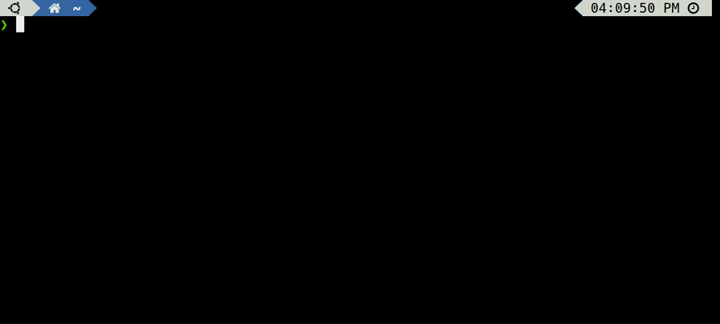

<h2 align="center">
Semgrep-based Policy controller for Kubernetes.
</h2>

Admission controller to use your well-known publicly available or custom Semgrep rules to validate k8s resources before deployment to the cluster.

:hammer_and_wrench: developed by [](https://securesystems.de/)

:zap: powered by [](https://semgrep.dev)

> :warning: semgr8s is in a proof-of-concept state. Do not use in production. Breaking changes, service interruptions, and development flow adjustments are expected.

## Getting started

Getting started to validate Kubernetes resources against Semgrep rules is only a matter of minutes:




### Requirements

- [git](https://git-scm.com/)
- Kubernetes cluster for testing (e.g. [kind](https://kind.sigs.k8s.io/), [microk8s](https://microk8s.io/docs), or [minikube](https://minikube.sigs.k8s.io/docs/start/))
- [kubectl](https://kubernetes.io/docs/reference/kubectl/)
- [Helm](https://helm.sh/)
- *(optional)* [yq v4.x](https://mikefarah.gitbook.io/yq/)
- *(optional)* [make](https://www.gnu.org/software/make/) (e.g. via [build-essential](https://packages.ubuntu.com/focal/build-essential))
- *(optional)* [docker](https://docs.docker.com/get-docker/)

### Get Code

Installation files are contained within this repository:

```bash
git clone https://github.com/semgr8ns/semgr8s.git
cd semgr8s
```

### Configuration & Installation

Semgr8s comes preconfigured with some basic rules.
However, configuration can be adjusted to your needs:

- Central configuration is maintained in `charts/semgr8s/values.yaml`.
- Configuration aims to provide the most native integration of Semgrep's functionality into Kubernetes. Working knowledge of Kubernetes and the [Semgrep documentation](https://semgrep.dev/docs/) should be sufficient to understand the concepts and options being used here.
- [Remote Semgrep](https://registry.semgrep.dev/rule) rules, rulesets, [repository rules](https://github.com/returntocorp/semgrep-rules) are configured via `.application.remoteRules` in `charts/semgr8s/values.yaml`, e.g. set to `"r/yaml.kubernetes.security.allow-privilege-escalation.allow-privilege-escalation"` or `"p/kubernetes"`, or `"r/yaml.kubernetes"` respectively.
- [Custom Semgrep rules](https://semgrep.dev/docs/writing-rules/overview/) can placed in `charts/semgr8s/rules/` and will be auto-mounted into the admission controller.
- Semgrep provides online tools to [learn](https://semgrep.dev/learn) and [create](https://semgrep.dev/playground/new) custom rules.

To deploy the preconfigured admission controller simply run:

```bash
helm install semgr8s charts/semgr8s --create-namespace --namespace semgr8ns
```
<details>
  <summary>output</summary>
  
  ```bash
  NAME: semgr8s
  LAST DEPLOYED: Tue Apr 25 00:16:04 2023
  NAMESPACE: semgr8ns
  STATUS: deployed
  REVISION: 1
  TEST SUITE: None
  NOTES:
  Successfully installed semgr8s!
  ```
</details>

You can check successful deployment of semgr8s via:

```bash
kubectl get all -n semgr8ns
```
<details>
  <summary>output</summary>
  
  ```bash
  NAME                           READY   STATUS    RESTARTS   AGE
  pod/semgr8s-665dbb8756-qhqv6   1/1     Running   0          7s

  NAME                      TYPE        CLUSTER-IP      EXTERNAL-IP   PORT(S)   AGE
  service/semgr8s-service   ClusterIP   10.96.135.157   <none>        443/TCP   7s

  NAME                      READY   UP-TO-DATE   AVAILABLE   AGE
  deployment.apps/semgr8s   1/1     1            1           7s

  NAME                                 DESIRED   CURRENT   READY   AGE
  replicaset.apps/semgr8s-665dbb8756   1         1         1       7s
  ```
</details>

Once all resources are in `READY` state, you have successfully installed semgr8s :rocket:

### Testing

Several test resources are provided under `tests/demo/`.
Semgr8s only validates resources in namespaces with label `semgr8s/validation=enabled`:

```bash
kubectl apply -f tests/demo/00_test-namespace.yaml
```
<details>
  <summary>output</summary>
  
  ```bash
  namespace/test-semgr8s created
  ```
</details>

It denies creating pods with non-compliant configuration according to the local rules in `charts/semgr8s/rules` and `.application.remoteRules`  `charts/semgr8s/values.yaml`:

```bash
kubectl apply -f tests/demo/40_failing-deployment.yaml
```
<details>
  <summary>output</summary>
  
  ```bash
  Error from server: error when creating "tests/demo/40_failing-deployment.yaml": admission webhook "semgr8s-svc.semgr8ns.svc" denied the request: Found 1 violation(s) of the following policies: 
  * rules.test-semgr8s-forbidden-label
  Error from server: error when creating "tests/demo/40_failing-deployment.yaml": admission webhook "semgr8s-svc.semgr8ns.svc" denied the request: Found 1 violation(s) of the following policies: 
  * yaml.kubernetes.security.writable-filesystem-container.writable-filesystem-container
  Error from server: error when creating "tests/demo/40_failing-deployment.yaml": admission webhook "semgr8s-svc.semgr8ns.svc" denied the request: Found 1 violation(s) of the following policies: 
  * yaml.kubernetes.security.privileged-container.privileged-container
  Error from server: error when creating "tests/demo/40_failing-deployment.yaml": admission webhook "semgr8s-svc.semgr8ns.svc" denied the request: Found 1 violation(s) of the following policies: 
  * yaml.kubernetes.security.hostnetwork-pod.hostnetwork-pod
  ```
</details>

Compliantly configured resources on the other hand are permitted to the cluster:

```bash
kubectl apply -f tests/demo/20_passing-deployment.yaml
```
<details>
  <summary>output</summary>
  
  ```bash
  pod/passing-testpod-1 created
  ```
</details>


### Cleanup

To remove all resources of the admission controller run:

```bash
helm uninstall semgr8s -n semgr8ns
kubectl delete ns semgr8ns
```
<details>
  <summary>output</summary>
  
  ```bash
  release "semgr8s" uninstalled
  ```
</details>

Test resources are deleted via:

```bash
kubectl delete -f tests/demo/
```
<details>
  <summary>output</summary>
  
  ```bash
  namespace "test-semgr8s" deleted
  pod "passing-testpod-1" deleted
  Error from server (NotFound): error when deleting "tests/demo/40_failing-deployment.yaml": pods "forbiddenlabel-pod" not found
  Error from server (NotFound): error when deleting "tests/demo/40_failing-deployment.yaml": pods "failing-testpod-1" not found
  Error from server (NotFound): error when deleting "tests/demo/40_failing-deployment.yaml": pods "failing-testpod-2" not found
  Error from server (NotFound): error when deleting "tests/demo/40_failing-deployment.yaml": pods "failing-testpod-3" not found

  ```
</details>

## Next steps

Excited about Semgr8s? Here is some next steps:

* :books: For more details, checkout the [docs](https://semgr8ns.github.io/semgr8s/latest/), e.g. on [Concept](https://semgr8ns.github.io/semgr8s/latest/concept/) or [Usage](https://semgr8ns.github.io/semgr8s/latest/usage/)
* :writing_hand: To share feedback, reach out via [GitHub Discussions](https://github.com/semgr8ns/semgr8s/discussions)
* :bug: Report bugs via [GitHub Issues](https://github.com/semgr8ns/semgr8s/issues)

